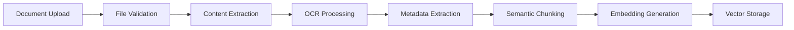
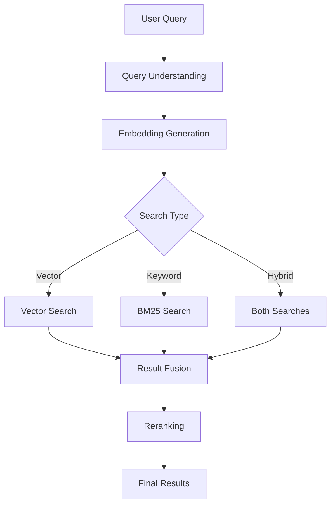

# Enterprise RAG System Architecture

## Overview

The Enterprise RAG System is designed as a microservices-based architecture that provides scalable, secure, and efficient document processing and retrieval capabilities.

## System Components

### 1. API Gateway Layer
- **FastAPI Application**: RESTful API endpoints
- **Authentication Service**: JWT-based auth with OAuth2 support
- **Rate Limiting**: Request throttling and quota management
- **Load Balancer**: Nginx for request distribution

### 2. Document Processing Pipeline



#### Components:
- **Document Processors**: Specialized handlers for each file type
- **OCR Engine**: Tesseract + Nougat for complex documents
- **Chunking Engine**: Semantic-aware text splitting
- **Embedding Service**: Multi-model embedding generation

### 3. Storage Layer

#### Vector Database (Qdrant)
- **Primary Storage**: Document embeddings and metadata
- **Collections**: Separate collections per document type
- **Indexing**: HNSW with optimized parameters
- **Sharding**: Horizontal scaling for large deployments

#### Object Storage (MinIO/S3)
- **Raw Documents**: Original uploaded files
- **Processed Content**: Extracted text and images
- **Model Artifacts**: Cached model files

#### Relational Database (PostgreSQL)
- **User Management**: Authentication and authorization
- **Document Metadata**: Searchable document properties
- **Audit Logs**: System activity tracking
- **Configuration**: Dynamic system settings

#### Cache Layer (Redis)
- **Query Cache**: Frequently accessed results
- **Embedding Cache**: Recent embeddings
- **Session Store**: User session management
- **Rate Limit Counters**: API usage tracking

### 4. Retrieval Pipeline



### 5. Generation Layer

#### LLM Integration
- **vLLM Server**: High-performance inference
- **Model Router**: Dynamic model selection
- **Prompt Management**: Template system
- **Response Processing**: Post-processing and validation

### 6. Integration Services

#### Atlassian Connector
- **Confluence Sync**: Real-time page updates
- **Jira Integration**: Issue tracking and search
- **Webhook Handler**: Event-driven updates
- **Batch Processor**: Bulk import/export

## Data Flow

### Document Ingestion Flow
1. User uploads document via API
2. Document validated and stored in object storage
3. Processing pipeline extracts content
4. Content chunked semantically
5. Embeddings generated for each chunk
6. Vectors stored in Qdrant with metadata
7. Document indexed for keyword search
8. User notified of completion

### Query Processing Flow
1. User submits search query
2. Query analyzed and classified
3. Relevant embeddings generated
4. Parallel vector and keyword search
5. Results merged and reranked
6. Context retrieved for top results
7. LLM generates response
8. Response returned with citations

## Security Architecture

### Authentication & Authorization
- **Multi-factor Authentication**: TOTP support
- **OAuth2 Integration**: Enterprise SSO
- **Role-Based Access Control**: Fine-grained permissions
- **API Key Management**: Service authentication

### Data Protection
- **Encryption at Rest**: AES-256 for sensitive data
- **Encryption in Transit**: TLS 1.3
- **Field-Level Encryption**: PII protection
- **Key Rotation**: Automated key management

### Audit & Compliance
- **Comprehensive Logging**: All actions tracked
- **Data Retention Policies**: Configurable retention
- **GDPR Compliance**: Right to deletion
- **Access Reports**: Usage analytics

## Scalability Design

### Horizontal Scaling
- **Stateless API Servers**: Easy replication
- **Distributed Processing**: Queue-based workers
- **Sharded Vector Storage**: Partition by tenant
- **Read Replicas**: Database scaling

### Performance Optimization
- **Connection Pooling**: Efficient resource usage
- **Batch Processing**: Bulk operations
- **Async Operations**: Non-blocking I/O
- **Caching Strategy**: Multi-level caching

## Deployment Architecture

### Kubernetes Deployment
```yaml
Components:
  - API Pods (3 replicas)
  - Worker Pods (5 replicas)
  - vLLM Pods (2 replicas, GPU)
  - Qdrant StatefulSet (3 nodes)
  - PostgreSQL (Primary + Replica)
  - Redis Cluster (3 nodes)
```

### Monitoring Stack
- **Prometheus**: Metrics collection
- **Grafana**: Visualization
- **ELK Stack**: Log aggregation
- **Jaeger**: Distributed tracing

## High Availability

### Redundancy
- **Multi-AZ Deployment**: Cross-zone replication
- **Automatic Failover**: Health-check based
- **Backup Strategy**: Automated snapshots
- **Disaster Recovery**: Point-in-time recovery

### Load Balancing
- **Geographic Distribution**: CDN integration
- **Smart Routing**: Latency-based
- **Circuit Breakers**: Fault isolation
- **Rate Limiting**: DDoS protection